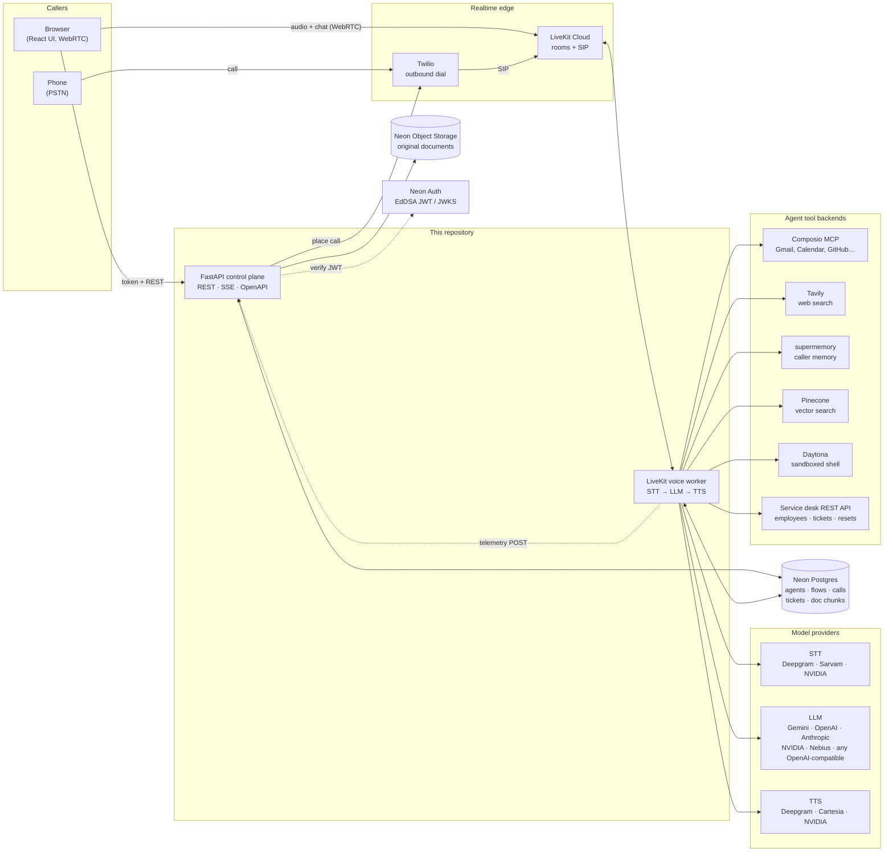
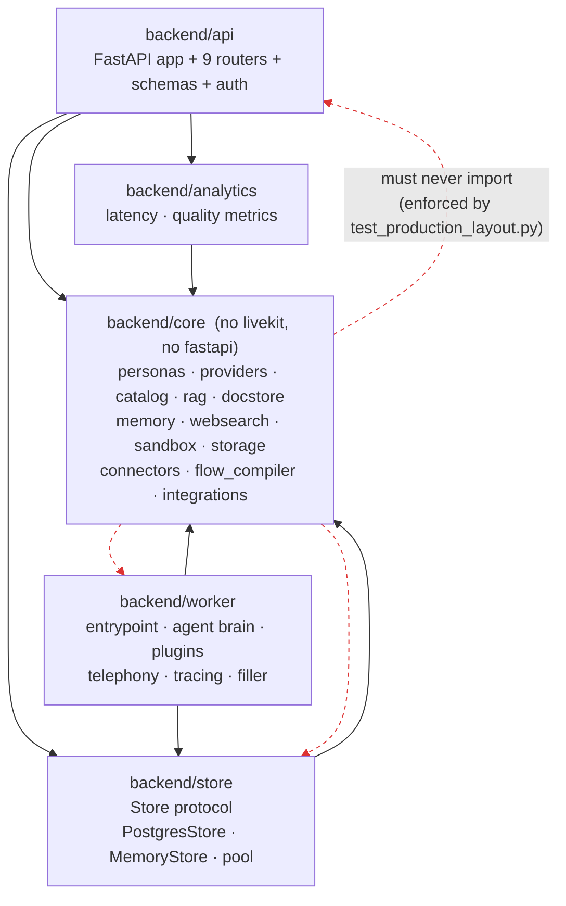
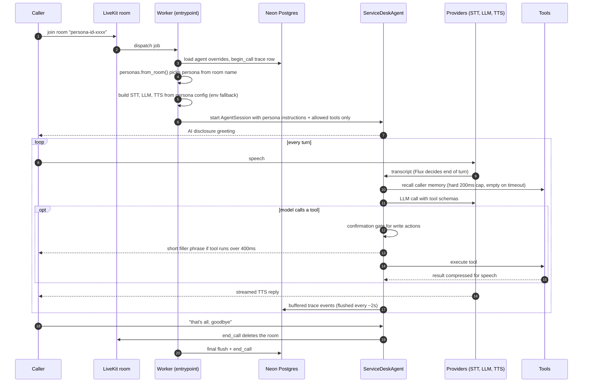
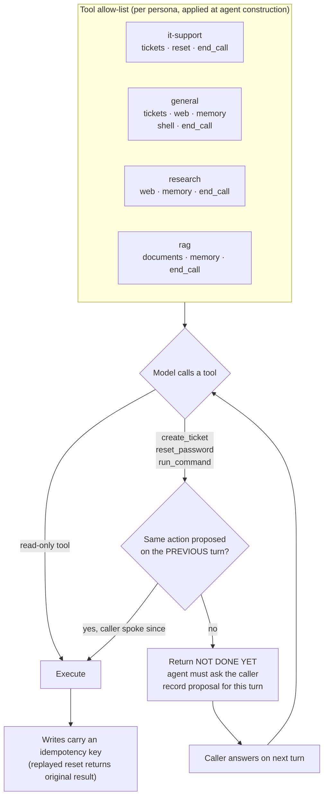
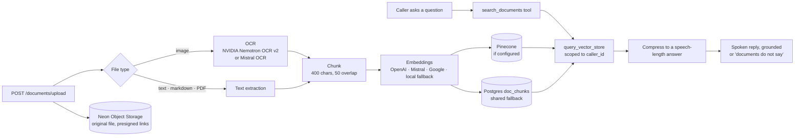
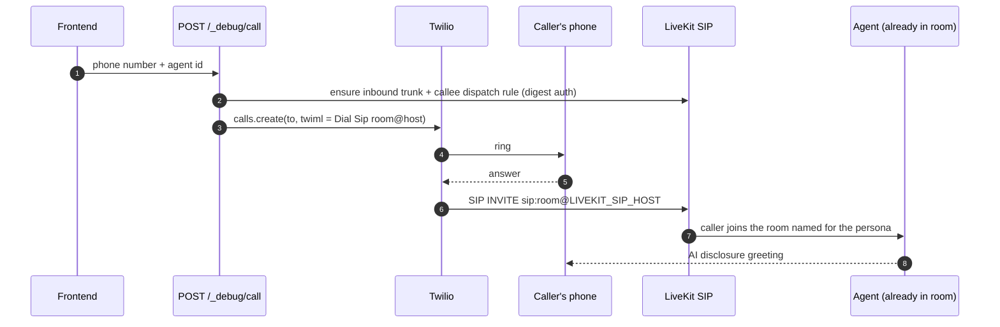
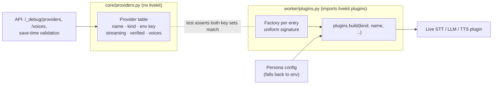
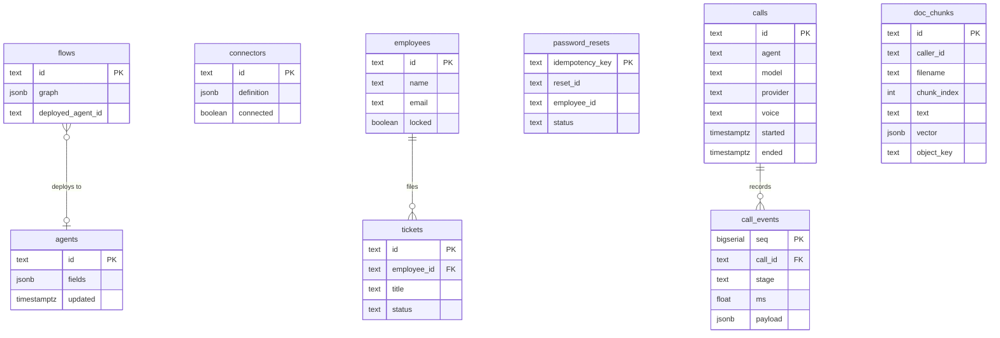
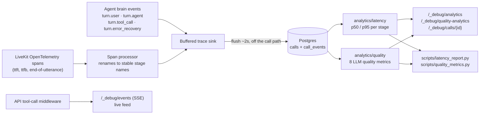

# Voice agent

A real-time **voice AI agent platform**: callers talk to an agent from a browser
or an ordinary phone, and the agent looks up tickets, resets passwords, searches
the web, answers from uploaded documents, remembers returning callers, and runs
commands in an isolated sandbox. Every agent, model, voice and tool set is
configurable at runtime through a REST API.

This repository is the backend: a **FastAPI control plane** and a **LiveKit voice
worker**, sharing one **Neon Postgres** database. The UI lives in
[voiceagent_frontend](https://github.com/Bhuvansai-16/voiceagent_frontend).

| | |
|---|---|
| **Language / runtime** | Python 3.11+, asyncio end to end |
| **Voice** | LiveKit Agents, WebRTC + SIP, Silero VAD, Deepgram Flux semantic end-of-turn |
| **API** | FastAPI, Pydantic response models on every route, OpenAPI at `/docs` |
| **Data** | Neon Postgres (psycopg3 async pool), Neon Auth (JWT), Neon S3 object storage |
| **AI providers** | Google Gemini, OpenAI, Anthropic, NVIDIA, Nebius, any OpenAI-compatible host |
| **Speech** | Deepgram, Sarvam, NVIDIA Riva (STT) · Deepgram Aura-2, Cartesia, NVIDIA Magpie (TTS) |
| **Integrations** | Composio MCP, Twilio, Tavily, Pinecone, supermemory, Daytona, Mistral / NVIDIA OCR |
| **Size** | ~10k lines of Python, 200+ tests |

## Highlights

- **Two-process design with a shared database.** The API and the voice worker
  never share a filesystem or memory. An upload through the API is searchable by
  the agent on the next call because both read the same Postgres tables.
- **Prompts are not guardrails.** Write actions (create ticket, reset password,
  run command) pass through a code-level confirmation gate; a persona's tool
  allow-list removes tools from the agent rather than asking it nicely not to
  use them.
- **Latency is measured, not guessed.** Every call is traced per stage (STT
  finalize, LLM first token, TTS first byte, each tool) from LiveKit's
  OpenTelemetry spans into Postgres, with p50/p95 reporting.
- **Eight LLM quality metrics** computed from call traces: task success, intent
  accuracy, tool selection, tool argument accuracy, groundedness, error
  recovery, context retention, turns to resolution.
- **Provider-agnostic.** LLM, STT and TTS are chosen per agent from a data table;
  one `openai-compatible` entry reaches any host that speaks the OpenAI protocol.
- **Cost-capped telephony.** Outbound calls carry three independent hard limits,
  so a hung agent cannot run up a phone bill.
- **Enforced layering.** A test walks the AST of `core/` and fails the build if
  it ever imports LiveKit, FastAPI, the worker or the store.

---

## Architecture

### 1. System context

Who talks to what. The browser and the phone both end up in a LiveKit room where
the worker's agent is waiting; the API is the control plane that configures it.



### 2. Code layout and dependency rules

Dependencies point inward. `core/` is pure domain and shared logic with no
framework imports, which is what lets both the API and the worker share it
without dragging LiveKit into the web process (or the other way around).



```text
backend/
  core/        domain and shared services. imports no livekit, no fastapi
  worker/      LiveKit runtime: session wiring, agent, plugins, telephony
  store/       Store protocol, PostgresStore, MemoryStore, schema.sql
  analytics/   trace analysis, served by the API and by the CLIs
  api/         FastAPI application and routers
  tests/
scripts/       migrate.py, smoke.py, serve.py and the report CLIs
skills/        instruction files a persona can load by name
```

`core/` may not import `livekit`, `fastapi`, `backend.api`, `backend.worker` or
`backend.store` — [test_production_layout.py](backend/tests/test_production_layout.py)
walks its AST and fails if that ever stops being true. Where `core/` needs a
database connection (the document store), the API and the worker inject it at
startup instead of importing it.

### 3. Life of a voice call

What happens from the moment a caller connects. Latency-sensitive steps are
marked; everything slow is kept off the critical path.



Key behaviours in that loop:

- **Barge-in.** Silero VAD plus a tunable `INTERRUPT_MIN_DURATION` lets the
  caller cut the agent off mid-sentence. Preemptive generation and preemptive
  TTS start work before end-of-turn is confirmed.
- **Semantic end-of-turn.** Streaming STTs (Deepgram Flux, Riva) report
  end-of-turn themselves, which saves roughly 260ms against VAD silence timeouts.
  A non-streaming STT automatically downgrades turn detection to VAD and logs a
  warning rather than silently getting slower.
- **Text turns too.** The browser chat box sends text over the LiveKit data
  channel; the worker feeds it to the same session.
- **Fillers stay out of context.** "Let me pull that up" plays straight to the
  caller and never enters the chat history, so the model cannot start quoting it.

### 4. Safety: confirmation gate and tool allow-lists

Two controls enforced in code, because a prompt is a suggestion.



- A write runs only if it was proposed on the previous turn, so two calls in one
  turn cannot get through and an approval expires after exactly one turn. This was
  added after a cheaper model ignored a "confirm first" prompt on every attempt.
- Password resets use an **idempotency key** that is the primary key of the
  `password_resets` table, so a barge-in mid-reset cannot trigger a second reset.
- The sandboxed shell exists only on the `general` persona, runs in Daytona with
  network egress explicitly blocked, and is capped by an execution timeout.

### 5. Document RAG pipeline

Upload through the API, answer by voice through the worker.



The fallback table matters: the first version kept chunks in a module-level
Python list, so the API appended to one copy while the worker searched another,
and an uploaded document was invisible to the agent. Moving it to Postgres made
the two processes agree.

### 6. Outbound phone calls

Twilio's REST API dials, then TwiML bridges the answered call into LiveKit over
SIP. No SIP trunk to hand-configure in the Twilio console.



Cost controls are layered so no single failure removes the ceiling: a time limit
on the Twilio leg, a hard `MAX_CALL_SECONDS` on the LiveKit trunk (enforced even
if the agent hangs or the worker dies), and a ringing timeout.

### 7. Provider abstraction

The *table* of what exists and the *factories* that build live plugins are split
across the layering boundary, keyed identically.



The API can validate a provider choice and list voices without importing a single
LiveKit plugin, and a test guarantees a provider cannot be added to one side and
forgotten on the other.

### 8. Data model

Configuration is stored as JSONB so a growing allow-list of agent settings does
not need a migration per field. Operational data is relational.



Two connection modes against Neon: the **pooled** (PgBouncer) endpoint for
runtime traffic, and the derived **direct** endpoint for schema migrations, since
DDL through transaction pooling is not reliable. `schema.sql` is idempotent and
doubles as the migration.

### 9. Observability



Stage names (`stt.finalize`, `llm.first_token`, `llm.complete`, `tts.first_byte`,
`tool.<name>`) are treated as a public contract: add freely, never rename.

---

## The four built-in agents

An agent is instructions plus a tool allow-list, a model, a voice and a speech
stack. The four below are the floor; more can be created and edited at runtime
through the API or the visual Flow Studio, which compiles a node graph into an
agent configuration.

| Agent | Tools | Purpose |
|---|---|---|
| `it-support` | tickets, password reset, end call | Narrow, safe: three actions, nothing else |
| `general` | + web search, memory, sandboxed shell | The only agent with a shell, which contains blast radius |
| `research` | web search, memory | Cites sources, says when results are contested |
| `rag` | document search, memory | Answers strictly from uploaded documents and OCR'd images |

The persona is chosen by the **room name**, so one worker process serves all
agents with no dispatch configuration.

## API surface

OpenAPI at <http://localhost:8002/docs>. Every route has a typed response model
and a tag.

| Router | Endpoints | Concern |
|---|---|---|
| Service desk | `GET /employees/{id}` · `GET/POST /tickets` · `POST /password-reset` | Agent-facing contract the tools call |
| Documents | `POST /documents/upload` · `GET /documents` · `POST /documents/query` · `GET /documents/{id}/link` · `DELETE` | RAG ingestion and query |
| Agents | `GET/PUT /_debug/agents` · `DELETE /_debug/agents/{id}` | Agent gallery CRUD |
| Flows | `GET/POST /_debug/flows` · `POST /_debug/flows/{id}/deploy` | Visual graph to deployed agent |
| Connectors | `/_debug/connectors/*` · `/_debug/composio/config` | Composio MCP connection and OAuth |
| Session | `GET /_debug/livekit-token` · `POST /_debug/call` · `GET /_debug/telephony` | Browser tokens, outbound calls |
| Catalog | `/_debug/models` · `/voices` · `/providers` | What the picker may offer |
| Telemetry | `/_debug/logs` · `/analytics` · `/events` (SSE) · `/traces` · `/calls/{id}` · `/quality-analytics` | Observability |
| Diagnostics | `/_debug/integrations` · `/_debug/state` | Integration health |

Auth: `backend/api/auth.py` verifies Neon Auth JWTs (EdDSA / Ed25519, JWKS key
set with caching, issuer checked against the origin) as a reusable FastAPI
dependency.

## Design decisions worth knowing

| Decision | Why |
|---|---|
| No LangGraph | LiveKit's `AgentSession` already runs one supervisor turn plus tool calls. A graph would add a hop and latency for no capability. |
| JSONB for agent config | The allow-list of configurable fields keeps growing; a column per field would need a migration each time. A lagging whitelist once silently dropped months of settings. |
| Per-agent models | Free-tier quotas are counted per model, so agents on different models get separate budgets. |
| Memory recall capped at 200ms | Recall runs inside the turn. A slow memory server must cost nothing, so it returns empty on timeout. |
| Tavily SDK over hosted MCP | The hosted MCP passes the API key in the URL query string, which ends up in logs and proxies. |
| Async everywhere | The blocking `boto3` client is dispatched via `asyncio.to_thread` so an upload never stalls the event loop. |
| Store protocol, two implementations | `MemoryStore` for no-network tests, `PostgresStore` for production, both run through one shared contract suite so the double cannot drift. |

---

## Setup

Requires Python 3.11+ and a Neon project. No virtual environment: dependencies
install into your Python directly.

```bash
pip install -r requirements.txt -r requirements-dev.txt
cp .env.example .env      # then fill it in
python scripts/migrate.py
```

`requirements.txt` is generated from `uv.lock`, so versions stay pinned even
without uv. Regenerate after changing `pyproject.toml`:

```bash
uv export --no-hashes --no-emit-project --format requirements-txt > requirements.txt
```

### What has to be in .env

- `NEON_CONNECTION_URI` - the **pooled** string; its hostname contains
  `-pooler`. The direct endpoint is derived from it automatically.
- `LIVEKIT_*`, `DEEPGRAM_API_KEY`, and one LLM provider key.
- `AUTH_URL` for Neon Auth. `JWKS_URL` is optional and defaults to
  `<AUTH_URL>/.well-known/jwks.json`, which is where the keys actually are.
- `AWS_ENDPOINT_URL_S3` and the `AWS_*` keys for object storage, if you want
  uploaded documents kept.

Everything else (Composio, Tavily, Pinecone, supermemory, Daytona, Twilio) is
optional; the matching tool simply is not attached when its key is absent.

Keep `.env` at the repository root. `load_dotenv()` searches upward from the
working directory, so a copy inside `backend/` is not found.

## Run

```bash
uvicorn main:app --reload --port 8002   # API
python -m backend.worker.main dev       # voice worker, separate terminal
```

The worker also runs as `console` (mic and speakers in the terminal, no LiveKit)
and `start` (production).

**`--reload` is not optional on Windows.** psycopg's async mode cannot run on
`ProactorEventLoop`, and uvicorn selects its loop with a factory rather than a
policy:

```python
if sys.platform == "win32" and not use_subprocess:
    return asyncio.ProactorEventLoop
```

so nothing the app sets at import time changes it. `--reload` runs the app in a
subprocess, which takes the selector branch. Without the reloader, use
`python scripts/serve.py --no-reload`, which drives the server on a loop it
chooses. Linux is unaffected.

`--port 8002` is not optional either. uvicorn's own default is 8000, and both
the frontend's vite proxy and the worker's `DEBUG_API_URL` look for 8002, so
the port is part of the command rather than a preference. `scripts/serve.py`
defaults to 8002 and needs no flag.

The API allows CORS from <http://localhost:5174>, where the frontend dev server
runs.

## Tests

```bash
uv run pytest
```

Over 200 tests. Most need no network and no credentials; the rest use the
`client` fixture and skip when `NEON_CONNECTION_URI` is absent. The store
contract suite runs the same cases against `MemoryStore` and against Neon, so the
test double cannot quietly drift from real Postgres semantics. Coverage includes
the confirmation gate, barge-in, tracing, telephony, RAG, auth, route parity
against a recorded baseline, and the layering rule.

## Diagnostics

```bash
uv run python scripts/smoke.py             # every provider, key and model, end to end
uv run python scripts/latency_report.py    # per-stage p50/p95 from call traces
uv run python scripts/quality_metrics.py   # the eight LLM quality metrics
```

The database starts empty. Employee, ticket and document records come from the
configured service integrations or through the normal API operations; no seed or
demo data is shipped.
